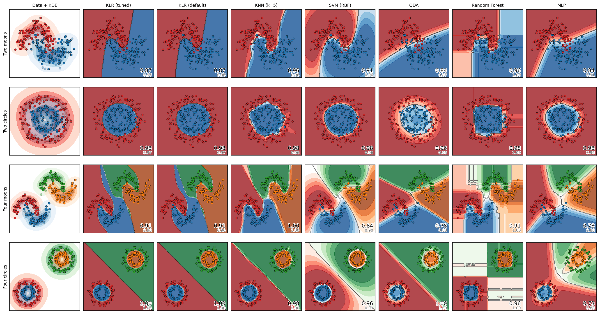
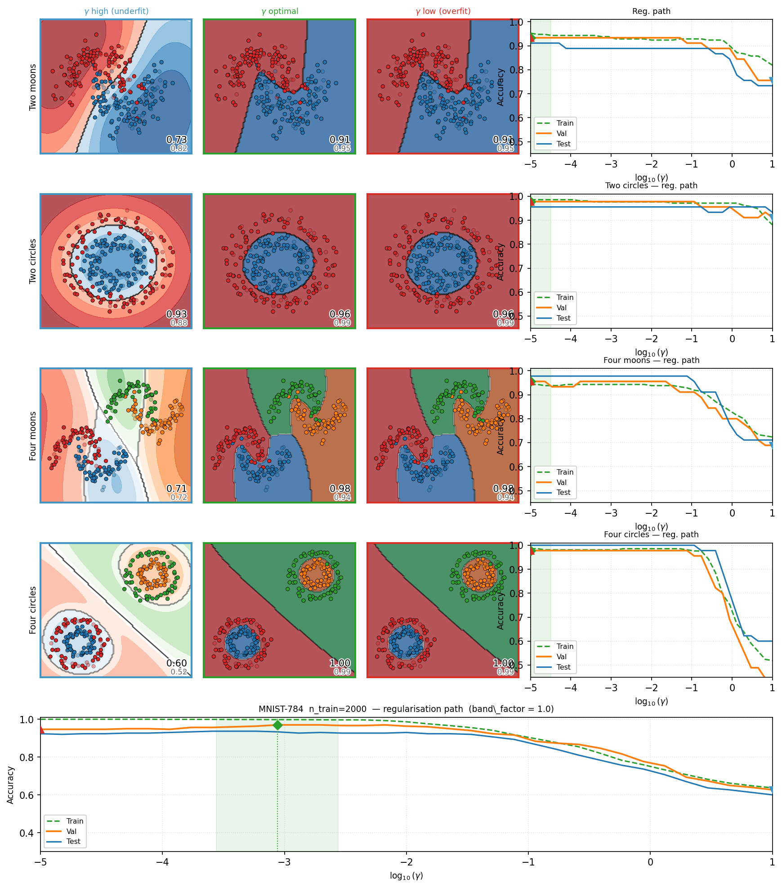

# Kernel Likelihood Ratio Classifiers (KLRC)

A Python implementation of **Kernel Likelihood Ratio Classifiers** — a family of
kernel-based methods for multi-class classification grounded in the
*separation-of-measure* phenomenon for Gaussian measures on Reproducing Kernel
Hilbert Spaces (Santoro, Waghmare & Panaretos 2025, 2026).

> **Work in progress** — API and results may change.

---

## Theoretical background

Given class-conditional distributions $\{P_j\}$, each embedded as a Gaussian
measure $\mathcal{N}(m_{P_j}, C_{P_j})$ on the RKHS $\mathcal{H}$, the optimal
classifier assigns a test point $x$ to the class with the highest regularised
log-likelihood:

$$\hat{j}(x) = \underset{j}{\arg\min}\; \bigl[(k_x - m_j)^\top (C_j + \gamma I)^{-1} (k_x - m_j) + \log|C_j + \gamma I|\bigr]$$

where $k_x = [k(x,x_1),\ldots,k(x,x_n)]^\top$ is the empirical feature vector
of $x$, and $m_j$, $C_j$ are the empirical mean and covariance of class $j$.
The ridge $\gamma > 0$ controls the overfitting / stability trade-off (see below).

---

## Decision boundaries

KLR versus standard classifiers on four synthetic 2-D datasets.
The first column shows the raw data with per-class KDE density contours;
subsequent columns show probability-shaded decision regions with
test accuracy (bold) and train accuracy (faded) annotated.



---

## Regularisation trade-off

The ridge $\gamma$ interpolates between two extremes:
- $\gamma \to \infty$: collapses to kernel nearest-centroid (smooth, stable)
- $\gamma \to 0$: approaches the perfect interpolating classifier (sharp,
  ill-conditioned)

The figure below shows decision boundaries at three representative $\gamma$
values (columns) across all four synthetic datasets (rows), together with
the full regularisation path (train / val / test accuracy vs $\log\gamma$).
The bottom panel replicates the path on MNIST-784.



---

## Repository structure

```
.
├── src/
│   └── classification/
│       ├── __init__.py
│       └── kernel_class.py        # KLRClassifier, BaggingKLRClassifier,
│                                  # NystromKLRClassifier
├── tests/
│   ├── classification.ipynb       # exploratory notebook
│   ├── bench_tabular.py           # Iris / Breast Cancer / Digits benchmarks
│   ├── bench_mnist.py             # MNIST-784 benchmark (memory-safe)
│   ├── bench_cifar.py             # CIFAR-10 benchmark + Nyström large-n
│   ├── bench_nystrom.py           # Nyström accuracy vs n_landmarks
│   ├── plot_decision_boundaries.py
│   ├── plot_ridge_tradeoff.py
│   ├── utils/
│   │   ├── synthetic_data_generation.py
│   │   └── run.py
│   └── out/
│       ├── images/                # saved figures
│       └── *.txt                  # benchmark tables
└── tex/
    └── main.tex                   # paper draft
```

---

## Classes

### `KLRClassifier`
Base kernel likelihood-ratio classifier (sklearn-compatible API).

| Parameter | Default | Description |
|---|---|---|
| `ridge` | `1e-3` | Tikhonov regularisation $\gamma$ |
| `band_factor` | `1.0` | Bandwidth multiplier (RBF median heuristic) |
| `ridge_mode` | `"absolute"` | `"absolute"` or `"spectral"` (scale-invariant) |
| `center_covariance` | `True` | Subtract class mean before covariance |
| `store_covariance` | `False` | Keep raw covariance matrices after fit |

```python
from src.classification import KLRClassifier

clf = KLRClassifier(ridge=1e-3).fit(X_train, y_train)
# or auto-tune over a (ridge, band_factor) grid:
clf = KLRClassifier().tune(X_train, y_train, X_val, y_val)
```

### `BaggingKLRClassifier`
Ensemble of KLR classifiers trained on stratified bootstrap subsamples.
Each bag's covariance has rank $\min(m, n_c)$, implicitly discarding the
spectral noise tail (*spectral pruning*).  Persistent memory scales as
$B \cdot C \cdot m^2 \cdot 8$ bytes.

```python
from src.classification import BaggingKLRClassifier

bag = BaggingKLRClassifier(
    base_estimator=KLRClassifier(ridge=1e-3),
    n_estimators=20, bag_size=0.15, n_jobs=1,
).fit(X_train, y_train)
```

### `NystromKLRClassifier`
KLR with Nyström kernel approximation for large-scale datasets.
Replaces the $n \times n$ kernel matrix with an $n \times m$ feature matrix
($m \ll n$ landmark points), reducing persistent memory from
$C \cdot n^2 \cdot 8$ bytes to $C \cdot m^2 \cdot 8$ bytes.

| `n` | Full KLR | Nyström $m=1000$ |
|-----|----------|-----------------|
| 5 000 | 2.0 GB | 0.09 GB |
| 50 000 | 200 GB | 0.09 GB |

```python
from src.classification import NystromKLRClassifier

clf = NystromKLRClassifier(n_landmarks=500).fit(X_train, y_train)
# or tuned:
clf = NystromKLRClassifier(n_landmarks=500).tune(X_train, y_train, X_val, y_val)
```

---

## Benchmark highlights

### MNIST-784  (`n_train = 4 000`)

| Method | Footprint | Test acc | Tune time |
|--------|-----------|----------|-----------|
| Full KLR (tuned) | 1.28 GB | 95.6% | 325 s |
| Nyström $m=500$ (tuned) | 0.023 GB | **95.8%** | **6.9 s** |
| Nyström $m=200$ | 0.005 GB | 94.9% | — |

### CIFAR-10 raw pixels  (`n_train = 4 000`)

| Method | Test acc | Time |
|--------|----------|------|
| KLR (tuned) | 45.1% | 311 s |
| Nyström $m=1000$ (tuned) | **45.6%** | **19.7 s** |
| Nyström $m=500$  | 39.4% | 4.9 s |

Note: raw-pixel CIFAR accuracy is intentionally modest; the goal is to study
computational behaviour and approximation quality, not to compete with
CNN-based methods.

---

## Memory safety

All benchmark scripts implement layered memory guards:
- `store_covariance=False` (default): discard raw covariance after Cholesky,
  halving persistent storage from $2 C n^2$ to $C n^2$ float64s.
- `n_jobs=1` in all bagging runs: prevents parallel memory explosion.
- `require_gb()` / `safe_n_train()`: dynamic checks before each experiment.
- Explicit `del` + `gc.collect()` between runs.

---

## References

- Santoro, Waghmare & Panaretos (2025). *From Two Sample Testing to Singular
  Gaussian Discrimination*. [arXiv:2505.04613](https://arxiv.org/abs/2505.04613)
- Santoro, Waghmare & Panaretos (2025). *Likelihood Ratio Tests via Kernel
  Embeddings*. To appear.
- Santoro (2026). *Kernel Likelihood Ratio Classifiers*. In progress.

---

**Author:** Leonardo Santoro
